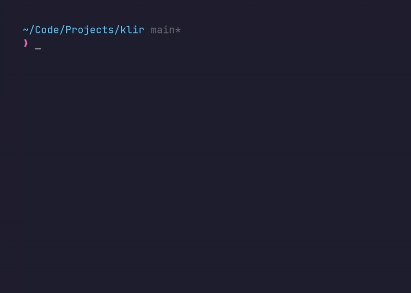

## **Klir**
Interactive CLI to bulk stop & delete Docker containers and images.

### **Usage**
```bash
klir [global options] <command> [command options]
```

### **Global Options**
- `-h`, `--help`   Show help  
- `-v`, `--version` Print version

---

### **Commands**

#### `klir stop`
Interactively stop running containers.

```bash
klir stop [OPTIONS]
```
Options:
- `-v`, `--verbose` Show debug logs

---

#### `klir rm`
Interactively remove **inactive** containers.

```bash
klir rm [OPTIONS]
```
Options:
- `-f`, `--force`  Allow removal of **running** containers  
- `-v`, `--verbose` Show debug logs

---

#### `klir rmi`
Interactively remove **orphaned** images.

```bash
klir rmi [OPTIONS]
```
Options:
- `-f`, `--force`  Allow removal of **active** images with stopped containers 
- `-v`, `--verbose` Show debug logs

### Result

